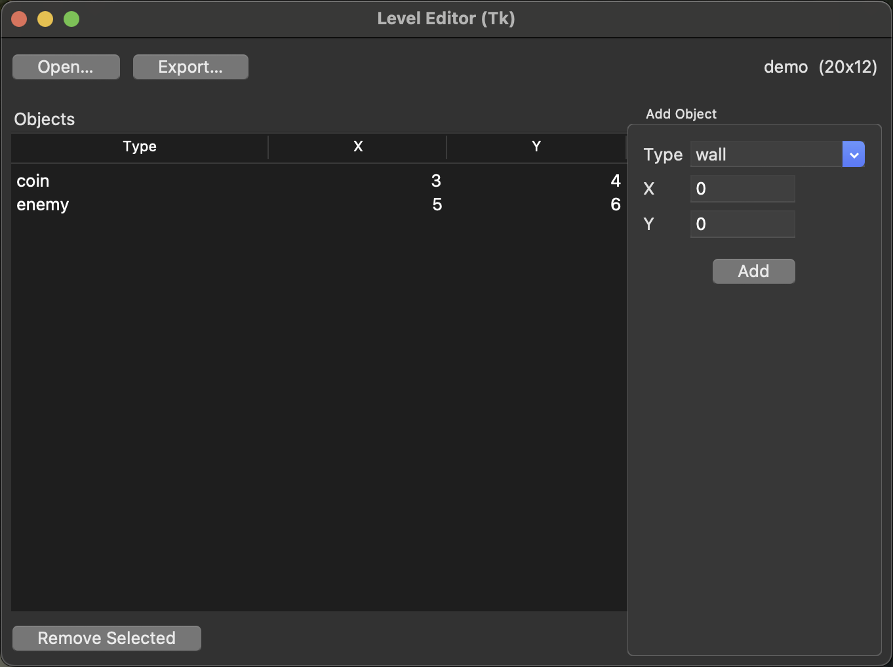

# Level Editor Tool (Python CLI + Tkinter GUI) — Exporter & Telemetry

[](https://github.com/jdawood1/level-editor-tool/actions)
[](LICENSE)

Developer-focused tooling prototype demonstrating **workflow automation, data exporters, telemetry logging, and GUI integration** — skills relevant to engine/tools work.

---

## Highlights
- **Level creation & editing:** Define tiles/objects, build levels, export to JSON
- **Validation:** Pydantic v2 schema validation (bounds, dimensions, types)
- **CLI commands:**
  - `new-level` — create levels
  - `add-object` — add objects to levels
  - `remove-object` — remove by index or (type, x, y) match
  - `stats` — summary stats by object type
  - `export` — produce final JSON version
- **Telemetry:** CSV log of operations (timestamp, action, duration)
- **Tkinter GUI:** Add/remove objects visually, open/export levels
- **Unit tests:** Pytest + GitHub Actions CI (tests, lint, formatting)

---

## Run in 30 seconds

```bash
# create venv + install deps
python -m venv .venv && source .venv/bin/activate
pip install -r requirements.txt

# create a level
python -m editor.cli new-level --name demo --width 20 --height 12

# add a few objects
python -m editor.cli add-object --level data/demo.json --type wall --x 3 --y 5
python -m editor.cli add-object --level data/demo.json --type coin --x 7 --y 2
python -m editor.cli add-object --level data/demo.json --type enemy --x 10 --y 6

# remove objects (index or match mode)
python -m editor.cli remove-object --level data/demo.json --index 0
python -m editor.cli remove-object --level data/demo.json --type coin --x 7 --y 2 --all

# see stats + export
python -m editor.cli stats --level data/demo.json
python -m editor.cli export --level data/demo.json --out build/demo_level.json
```

**Outputs**
- `data/demo.json` → editable level
- `build/demo_level.json` → exported version
- `build/telemetry.csv` → logged CLI actions

---

## Tkinter GUI

```bash
# launch GUI
python -m editor.gui data/demo.json
```



Features:
- Open & Export buttons
- Object table (Type, X, Y)
- Add & Remove controls
- Telemetry logging for GUI actions

---

## Repo Structure

```
level-editor-tool/
  editor/
    cli.py        # CLI entrypoint (Click)
    core.py       # core logic
    gui.py        # Tkinter GUI wrapper
    models.py     # Pydantic models (Level, LevelObject)
    telemetry.py  # telemetry logger
  tests/
    test_core.py  # core logic tests
    test_models.py # model validation tests
  data/           # working levels (demo.json committed as example)
  build/          # exports + telemetry logs
  requirements.txt
  pyproject.toml
  README.md
```

---

## Roadmap
- [x] `remove-object` CLI command
- [x] Tkinter GUI wrapper
- [ ] Richer validation errors (duplicate objects, invalid coords)
- [ ] Schema versioning + migrations
- [ ] Drag/drop GUI editing, keyboard shortcuts

---

## License
MIT © 2025 John Dawood
